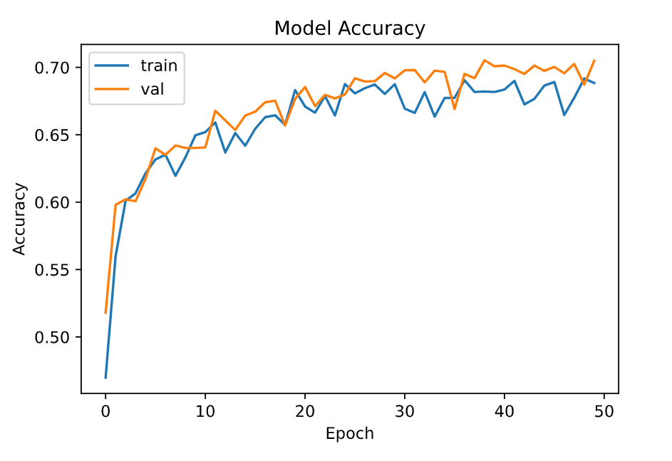
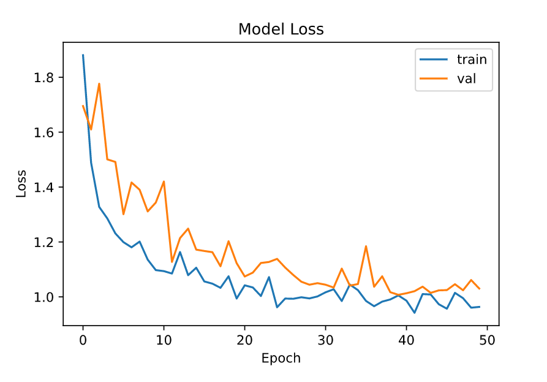

# Virtual Try-on project

@Author: Alex Nguyen | Gettysburg College

This repo is the composition of multiple applications that can derive the generation of try-on image given the input image of the person and the image of the clothing.

# Experiment
## Approach

1. According to the [VITON paper](#Reference), the process of producing a try-on image is motivated by a self-supervised learning approach, and the pipeline can be described as below:
   * Firstly, the person images are extracted into a set of image channels called <b>Person Representation</b>. According to the paper, a person representation is clothing-agnostic, which contains a set of features ([see image](#Approach)), including pose, body parts, face and hair, as a prior to
constrain the synthesis process.
    
    

    * These feature, are then concatnated with the clothing image, going through a encoder-decoder like network with skip connections like U-NET. And predict the actual try-on image based on perceptual loss with the original person with clothing ground truth.

2. To achieve the pose detection feature, [mediapipe](https://google.github.io/mediapipe/) from Google was taken into advantage. To test the pose detection, please refer to the [pose doc](https://google.github.io/mediapipe/solutions/pose.html) on the library's page, and navigate to [`pose_notebook.py`](./pose_notebook.py) to test on your webcam. Note that the functionality has also been imported to the main pipeline in [`notebook.py`](./notebook.py)

3. To achieve human parsing feature, a fully connected convolutional auto-encoder with U-Net architecture was implemented using pretrained model [MobileNetV2](https://www.tensorflow.org/api_docs/python/tf/keras/applications/MobileNetV2) that makes use of 'imagenet' weights and deconvolutional (upsampling) layers taken from [pix2pix](https://www.tensorflow.org/tutorials/generative/pix2pix) tensorflow examples. The idea is also taken from the (human parsing papers)[](#Reference).
   * Here is the loss and accuracy achieved by the U-Net with MobileNetV2:

      
      

        
        
        
        
        

## Installation
* This repo is in initial state that only contains jupyter notebook version of the code (not the full pipeline library/api). To experiment and execute the code cell in each `notebook.py` file, please install the following:
  * [Visual Studio Code](https://code.visualstudio.com/): Visual Studio Code is needed to run the python file as cell ("`# %%`" represent a new cell).
  * [Conda/Anaconda](https://www.anaconda.com/): Anaconda contains the needed python package and the needed jupyter kernel in order for VS Code to run the jupyter notebook.
  * Install python dependency packages: `pip install -r requirements.txt` 
  * Download the dataset:
    * [Look into person dataset](https://drive.google.com/file/d/1mLHY6m24jkPlCze_TUJvbU9BoXAedGs9/view): This dataset is the clothing dataset for the main virtual try-on task.
    * [Human Parsing dataset](https://drive.google.com/drive/folders/1ZjNrTb7T_SsOdck76qDcd5OHkFEU0C6Q): This is the dataset for training human parsing task, in order to create human representation.
  * Finally, when you are running the notebook, try to config the right path to the dataset.

* Here are some more datasets that you can look over:
    * [Look into person dataset family](http://sysu-hcp.net/lip/overview.php): This dataset family is very useful for the human parsing task anf VITON task.

## Reference
1. Try-on paper: This paper have the whole basic pipeline, although it's not the state-of-the-art pipeline, it serves as the fundamental baseline.
```
@inproceedings{8578885,
  author={X. {Han} and Z. {Wu} and Z. {Wu} and R. {Yu} and L. S. {Davis}},
  booktitle={2018 IEEE/CVF Conference on Computer Vision and Pattern Recognition}, 
  title={VITON: An Image-Based Virtual Try-on Network}, 
  year={2018},
  volume={},
  number={},
  pages={7543-7552},
  doi={10.1109/CVPR.2018.00787}}
```

2. Human Parsing paper: This paper experiments and compares approaches of human parsing task.
```
@inproceedings{_,
    author = {Gong, Ke and Liang, Xiaodan and Zhang, Dongyu and Shen, Xiaohui and Lin, Liang},
    year = {2017},
    month = {07},
    pages = {6757-6765},
    title = {Look into Person: Self-Supervised Structure-Sensitive Learning and a New Benchmark for Human Parsing},
    doi = {10.1109/CVPR.2017.715}
}
```

3. FCN network in human parsing.
```
@inproceedings{7298965,  
    author={J. {Long} and E. {Shelhamer} and T. {Darrell}},  
    booktitle={2015 IEEE Conference on Computer Vision and Pattern Recognition (CVPR)},   
    title={Fully convolutional networks for semantic segmentation},   
    year={2015},  
    volume={},  
    number={},  
    pages={3431-3440},  
    doi={10.1109/CVPR.2015.7298965}}
```